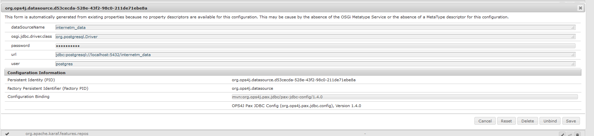

####1. Install features for JPA in Apache Karaf:
    
   ```
   feature:install jpa transaction jdbc jndi pax-jdbc pax-jdbc-config hibernate hibernate-envers scr war webconsole
   ```

####2. Install additional bundles:
    
   ``` 
     install -s mvn:org.postgresql/postgresql/42.2.8
   ```
   
   ``` 
     install -s mvn:com.google.guava/guava/18.0
   ```
    
   ``` 
     install -s mvn:com.mysema.commons/mysema-commons-lang/0.2.4
   ```
   ``` 
     install -s mvn:com.querydsl/querydsl-core/4.2.2
   ```
   ``` 
     install -s mvn:com.querydsl/querydsl-jpa/4.2.2
   ```

####3. Install Apache Karaf CXF feature

   ```
     feature:repo-add cxf 3.3.4
     feature:install cxf cxf-core cxf-jaxrs cxf-jaxws http-whiteboard        
   ```
  

####4. Create a datasource in Apache Karaf
    
   ```
   karaf@root()> jdbc:ds-create  --driverClass org.postgresql.Driver -url "jdbc:postgresql://localhost:5432/internetm_data" -u postgres -p postgres  internetm_data
   ```
   Watch that there is only one Datasource created (if you have for example pax-jdbc-postgresql installed there will be 2, 
   uninstall pax-jdbc-postgresql in this case).
   
   See also in the webconsole:
   
   
   
   
####5. Install module **internet-data** via bundle:install
    
   ```
   bundle:install file:E:/_DEV/_git_repos/internet/internet-data/target/internet-data-1.0.0.jar
   ```
   
   after that start the bundle, and very the components in the webconsole.

####6. Install module **internet-rest** via bundle:install
   
   ```
   bundle:install file:E:/_DEV/_git_repos/internet/internet-rest/target/internet-rest-1.0.0.jar
   ```
   after that start the bundle, and very the components in the webconsole.

